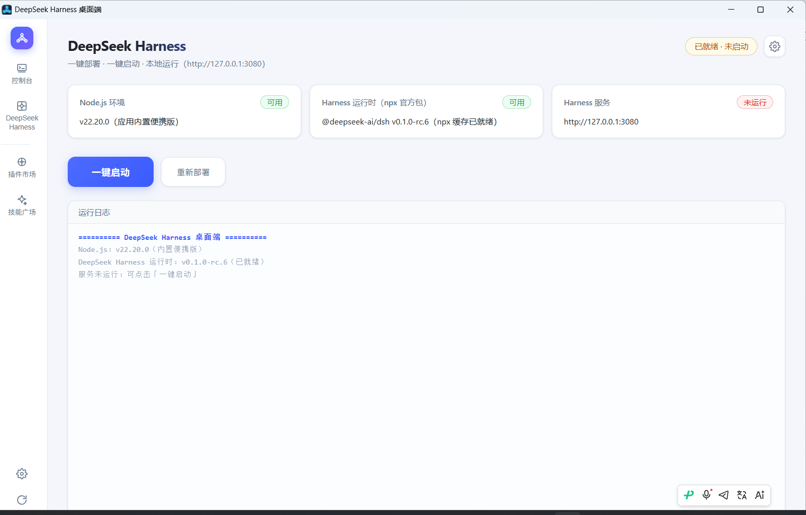
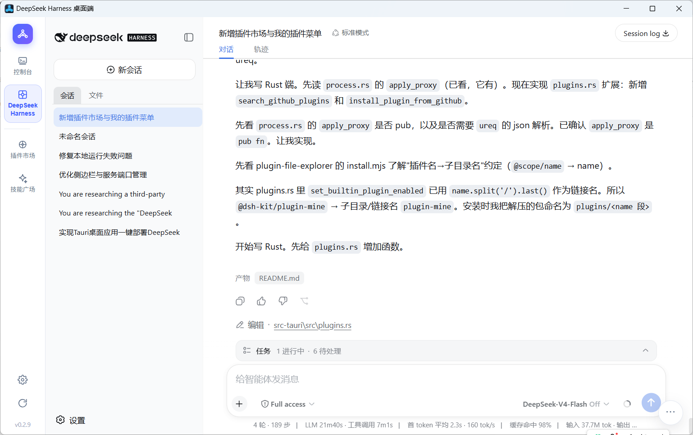
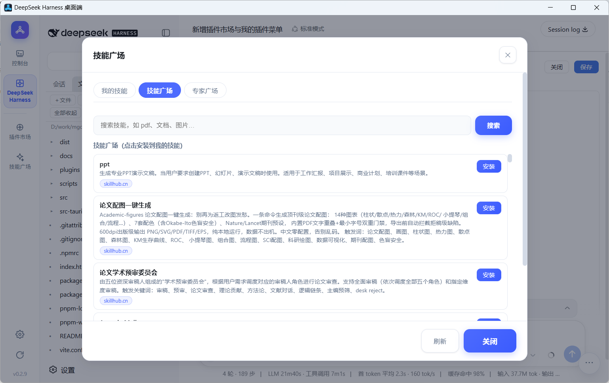
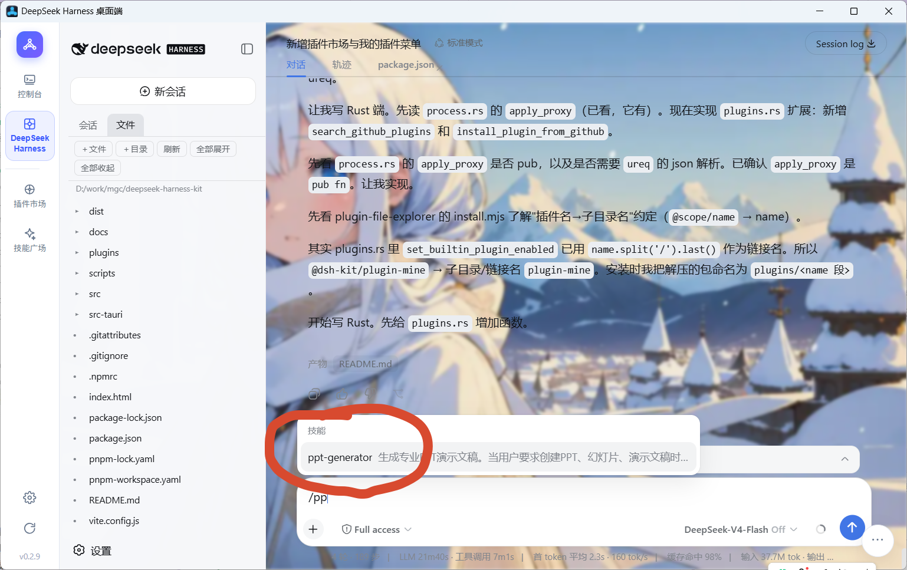
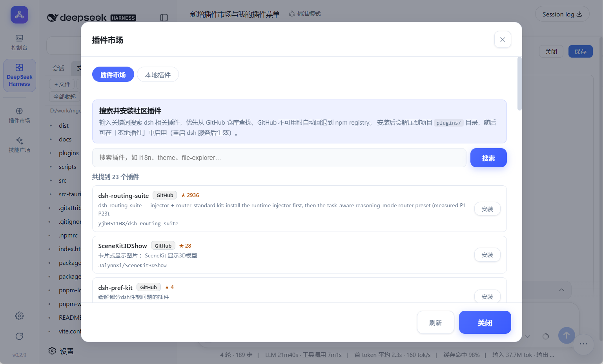
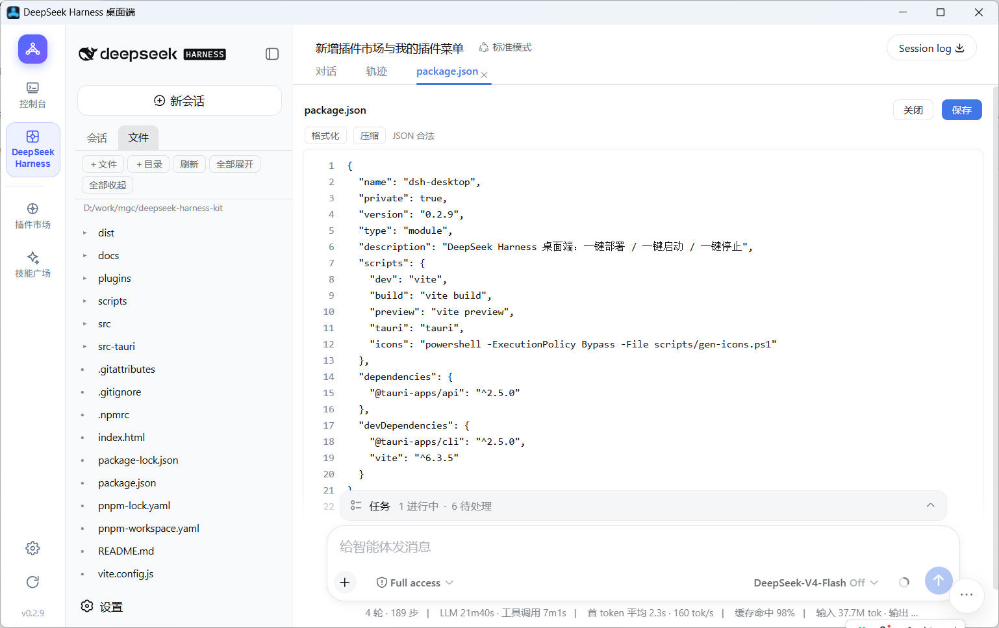
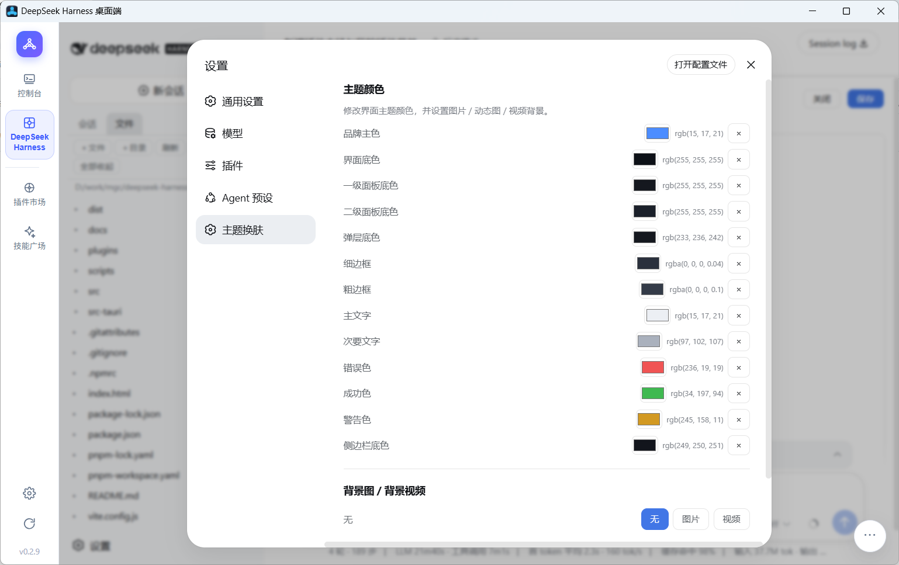
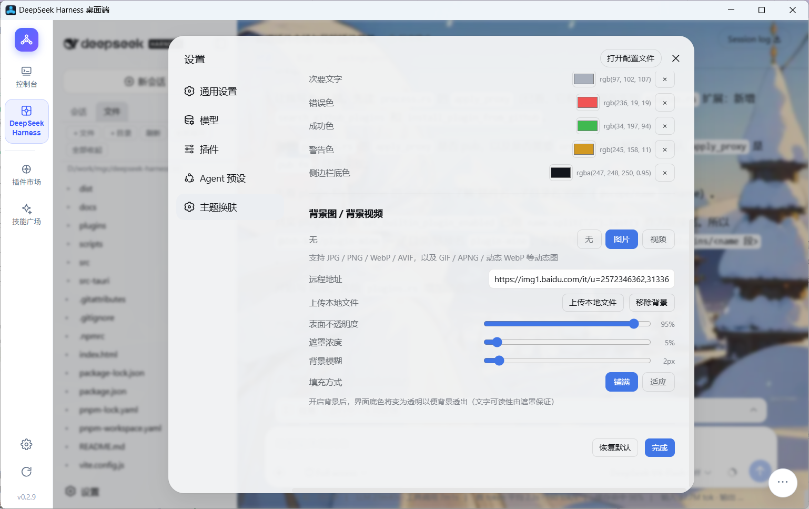

# DeepSeek Harness 桌面端（dsh-desktop）

一个基于 **Tauri 2** 的 Windows 桌面应用：一键部署并运行
[DeepSeek Harness](https://gitcode.com/gh_mirrors/de/deepseek-harness)（GitCode 镜像仓库），
免去手动装环境、克隆、安装依赖、构建的繁琐步骤。

## 界面效果图

### 启动与环境检测

一键部署 / 启动时自动检测 Node.js 与 dsh 运行时，版本不符或缺失时自动下载便携版 Node，日志实时滚动：



服务就绪后，主界面左侧为控制台，中间直接内嵌 DeepSeek Harness Web UI：



### 技能广场与技能调用

技能广场：浏览 / 搜索技能广场（skillhub.cn 数据源），一键安装技能与专家：



在 Harness 对话中输入 `/` 呼出技能候选菜单，选择已安装技能后技能指令自动注入对话：



### 插件市场与内置插件

插件市场：「本地插件 / 在线搜索 / 外部内置插件」三个 Tab，可启停内置插件、从 GitHub / npm 搜索安装新插件：



文件列表插件：侧边栏工作区改「会话 / 文件」双 Tab，文件 Tab 以文件树浏览当前会话工作区，点击文件后中间变为「对话 | 文件A | 文件B …」多 Tab 编辑（代码高亮、JSON / MD / HTML 预览、图片视频等）：



### 主题换肤

主题换肤：覆盖品牌色 / 底色 / 边框 / 文字等令牌色，并支持背景图（含 GIF / APNG / 动态 WebP）与背景视频（MP4 / WebM / OGG）：



背景图效果，以及动态背景图的实际演示：




## 功能

- **侧边栏单一入口**：点击侧边栏菜单在「控制台」与「Harness 页面」之间切换。
- **一键部署**：自动完成
  1. Node.js 检测（系统 Node 需 `^22.19 || >=24`，不满足或缺失时自动下载便携版 Node）；
  2. 通过 **`npx --yes @deepseek-ai/dsh web --help`** 获取官方发布的 DeepSeek Harness 运行时（预编译 npm 包，无需克隆源码、无需 pnpm、无需构建）；
  3. （可选）自动启动服务。
- **一键启动 / 一键停止**：后台运行 `npx --yes @deepseek-ai/dsh web --port <设置端口>`，等待端口就绪；停止时结束整棵进程树。
- **内嵌页面**：服务运行中时，中间面板直接内嵌 DeepSeek Harness 的 Web UI；若系统已部署且正在运行，打开应用即直接进入页面。
- 运行日志实时滚动显示；设置可配置镜像源（默认 npmmirror）、端口（会传递给 `dsh web --port`）、退出是否停止服务等。

## 目录结构

```
├── index.html              # 前端入口
├── src/                    # 前端（原生 JS + Vite）
│   ├── main.js
│   └── styles.css
├── src-tauri/              # Tauri / Rust 后端
│   ├── src/
│   │   ├── main.rs         # 入口
│   │   ├── lib.rs          # 应用装配、退出清理
│   │   ├── commands.rs     # Tauri 命令（get_status / deploy / start / stop …）
│   │   ├── deploy.rs       # 一键部署编排（Node + npx 运行时）
│   │   ├── service.rs      # 服务启停、端口探测
│   │   ├── process.rs      # 进程执行、日志流
│   │   ├── download.rs     # 下载与解压
│   │   └── state.rs        # 设置、路径、运行时检测
│   ├── tauri.conf.json
│   └── icons/              # 应用图标（scripts/gen-icons.ps1 生成）
└── scripts/gen-icons.ps1
```

## 本地开发

前置：Node.js ≥ 18（构建打包需要 Rust MSVC 工具链）、Windows 10/11（自带 WebView2）。

项目已内置 `.npmrc`（registry 指向 npmmirror），并同时提供 `package-lock.json` 与 `pnpm-lock.yaml`，
`npm` 或 `pnpm` 均可直接安装：

```sh
npm install        # 或 pnpm install
npm run tauri dev  # 开发模式
npm run tauri build  # 打包（NSIS 安装包输出到 src-tauri/target/release/bundle/）
```

## 部署流程说明

- 数据目录：`%LOCALAPPDATA%\DSHDesktop\`
  - `node/` — 便携版 Node.js
  - `downloads/` — 下载缓存
  - `settings.json` — 应用设置
  - `dsh.installed` / `dsh.version` — 部署标记
- 运行时来源：npm 上的官方包 `@deepseek-ai/dsh`（`npx --yes @deepseek-ai/dsh web --port <port>`），
  缓存于 npm 的 npx 缓存目录（`%LOCALAPPDATA%\npm-cache\_npx`）。
- 服务地址：`http://127.0.0.1:<设置端口>`（默认 3080，可在设置中修改并传递给 `--port`）
- 二进制下载源：npmmirror（`registry.npmmirror.com/-/binary`），Node 失败时回退 nodejs.org。

## 注意事项

- 部署过程首次耗时较长（下载 ~75MB 工具 + 安装数百个 npm 包 + 全量构建），请耐心等待日志完成。
- 首次进入 Harness 页面后，需在页面内完成模型 API Key 等配置（与直接使用 DeepSeek Harness 相同）。
- 应用退出时默认自动停止服务（可在设置中关闭，以便服务保持后台运行）。

## 更新与发布

- 侧边栏底部「检查更新」按钮：通过 GitHub Releases（`AlwaysSum/deepseek-harness-kit`）检测新版本，
  发现新版本后可直接下载安装包并运行安装程序；自动使用系统代理（FlClash 等）与国内加速镜像。
- 发布新版本（两种方式任选）：
  - **本地脚本（推荐）**：`scripts/publish-release.ps1`，token 放环境变量，一键打 tag + 发布到 GitHub 与 GitCode：
    ```powershell
    $env:GITHUB_TOKEN = "github_pat_xxx"     # 可选，缺省则跳过 GitHub
    $env:GITCODE_TOKEN = "xxx"               # 可选，缺省则跳过 GitCode
    .\scripts\publish-release.ps1 -Build -TagAndPush
    # 常用参数：-Version 0.2.0（默认读 tauri.conf.json）/-SkipGitHub /-SkipGitCode /-Proxy http://127.0.0.1:7890
    ```
  - **GitHub Actions 自动发布**：打 tag `v0.1.0` 后自动构建并发布到 GitHub；若在仓库
    Settings → Secrets 配置了 `GITCODE_TOKEN`，则同步发布到 GitCode。
- 版本号三处保持一致：`package.json`、`src-tauri/Cargo.toml`、`src-tauri/tauri.conf.json`。

## 国内网络构建提示（仅对源码构建者）

- crates.io 直连较慢：建议在 `%USERPROFILE%\.cargo\config.toml` 配置 rsproxy 稀疏镜像
  （`sparse+https://rsproxy.cn/index/`）。
- Tauri 打包 NSIS 时会从 GitHub 下载 NSIS 工具链，国内会超时；可提前将
  `nsis-3.11.zip` 与 `nsis_tauri_utils.dll` 放入 `%LOCALAPPDATA%\tauri\NSIS\`（SHA1 校验，
  需保持官方文件一致），打包器检测到文件齐全后会自动跳过下载。
- 仓库依赖全部来自 npm registry（无 GitHub 依赖），部署时使用 npmmirror 镜像即可。

## 技术栈

| 层 | 技术 |
| --- | --- |
| 桌面框架 | [Tauri 2](https://tauri.app)（Rust + WebView2） |
| 前端 | 原生 JS + [Vite 6](https://vitejs.dev) |
| 后端 | Rust：`ureq` 下载（支持系统代理）、`zip` 解压、进程树管理 |
| 运行时 | 官方 `@deepseek-ai/dsh` npm 包（`npx` 直接调用，无需源码构建） |
| 打包 | NSIS 安装包（`currentUser`，无需管理员权限） |

## 相关链接

- 上游项目：DeepSeek Harness — [GitHub](https://github.com/deepseek-ai/deepseek-harness) / [GitCode 镜像](https://gitcode.com/gh_mirrors/de/deepseek-harness)
- 本仓库发布页：GitHub [Releases](https://github.com/AlwaysSum/deepseek-harness-kit/releases) / GitCode [Releases](https://gitcode.com/Sunflower816/deepseek-harness-kit/releases)
- Star 趋势图：[star-history.com](https://star-history.com/#AlwaysSum/deepseek-harness-kit&Date)

## Star History


<a href="https://www.star-history.com/?repos=AlwaysSum%2Fdeepseek-harness-kit&type=date&legend=top-left">
 <picture>
   <source media="(prefers-color-scheme: dark)" srcset="https://api.star-history.com/chart?repos=AlwaysSum/deepseek-harness-kit&type=date&theme=dark&legend=top-left&sealed_token=pSThRI5jpPdAgZv9eExPnotL8eaaeDAcrQcZUEehfhGRDkRd0Mde8K9udcSndqia8lzvOUchngVz70l95aYFVlM4zr7iujXF92CPahT-K00JNhqOApNEmA" />
   <source media="(prefers-color-scheme: light)" srcset="https://api.star-history.com/chart?repos=AlwaysSum/deepseek-harness-kit&type=date&legend=top-left&sealed_token=pSThRI5jpPdAgZv9eExPnotL8eaaeDAcrQcZUEehfhGRDkRd0Mde8K9udcSndqia8lzvOUchngVz70l95aYFVlM4zr7iujXF92CPahT-K00JNhqOApNEmA" />
   
 </picture>
</a>
